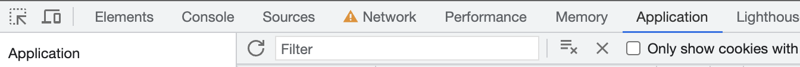

# Samsung Pinger

Samsung Pinger is a MacOS widget that lets you quickly ring your Samsung device.

Simply open notification center, click on the widget and your Samsung phone will ring even if it's in silent mode for one minute!

[Download](https://github.com/vityaschel/samsung-pinger/releases)

🇷🇺 Fully localized both in Russian and English languages.

## Setup

you absolutely can do this! I believe in you! it takes less than a minute :)

1. Download latest release from [downloads page](https://github.com/vityaschel/samsung-pinger/releases) and install it
2. You must obtain 2 tokens from cookies and a persistant "device id" that does not change. Open https://smartthingsfind.samsung.com/
3. Login into your account if needed. Make sure you're at https://smartthingsfind.samsung.com/. Open devtools it with ⌘+⌥+I
4. Go to "Application" tab 
5. Find "Cookies" -> "https://smartthingsfind.samsung.com" at sidebar 
6. In long list find these two cookies: "JSESSIONID", "WMONID". Copy their values to corresponding fields in App's settings  
7. Reload the page WITHOUT closing devtools
8. Go to "Network" tab in devtools, type "getDeviceList" in Filter field, click on the last (and usually the only) item in list
9. Go to "Response" tab in the opened submenu 
10. Here is a list of all your devices in JSON format. Find the right one (that you want to ping) in this list. Near it's name you will find (`modelName`) — this is called a "property" in JSON format. Locate nearest `dvceID` property in this brackets as shown on screenshot and fill it in the corresponding field. 

## Under the hood

Read [my notes](https://gist.github.com/VityaSchel/fe8945c0189bbaabed420003bdf3216d) on reverse-engineering smartthingsfind website.

## Hire me!

I'm available for hire if you can provide me with a work visa in Canada. Check out my resume: [cv.hloth.dev](https://cv.hloth.dev).